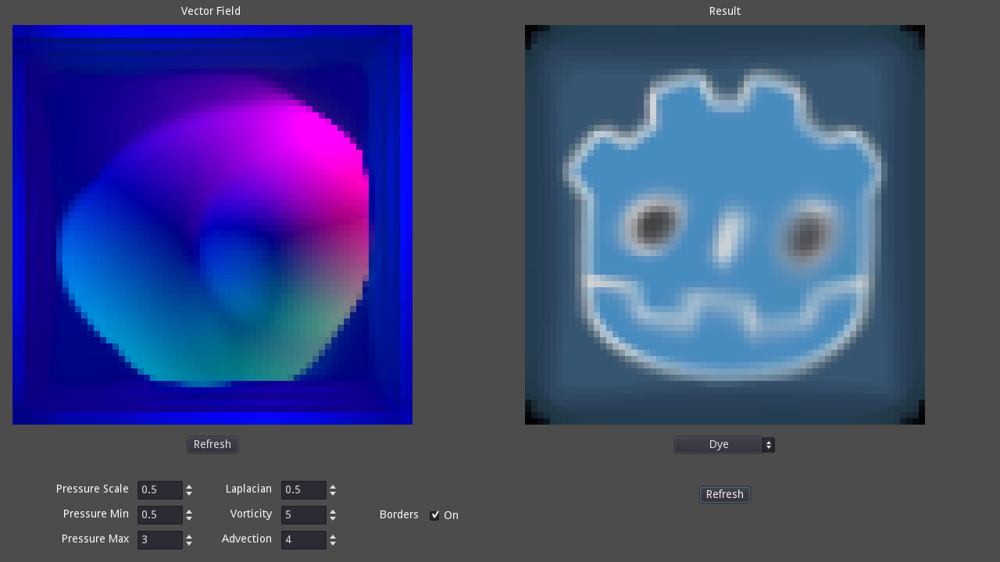
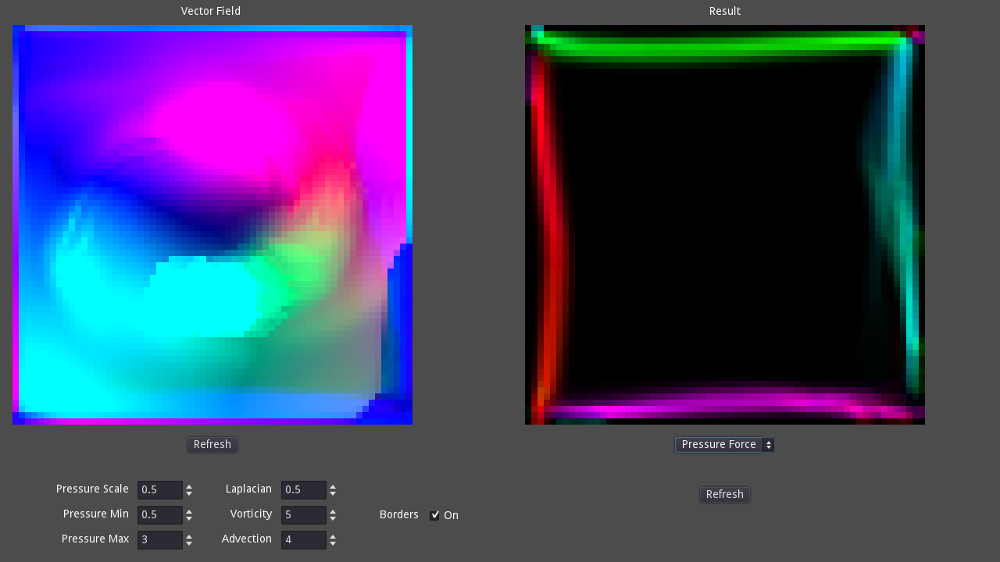
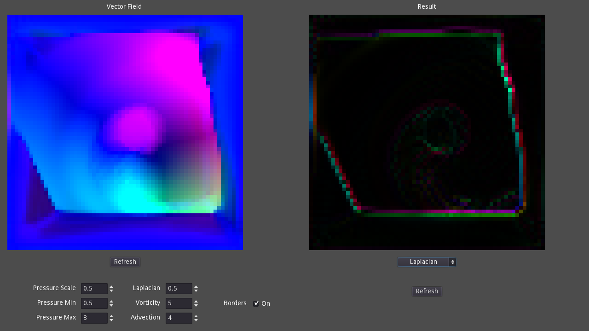
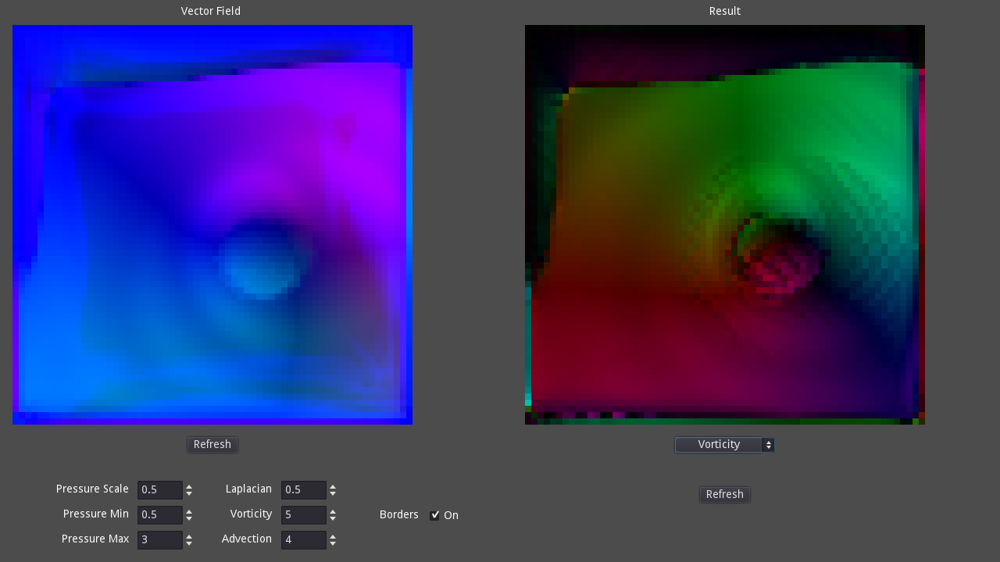

# 2D Fluid Simulator
### In progress  
Made in Godot 3.4.2

## Description

A 2D fluid simulation implemented in Godot. The multi-pass solution is getting deprecated. A single-pass solution using a semi-lagrangian scheme (instead of the often referenced jacobi iterative method) is the focus of future development.

## Issues

The advection shader does not work in the web version. Related error is likely:

`WebGL warning: drawElementsInstanced: Texture level 0 would be read by TEXTURE_2D unit 2, but written by framebuffer attachment COLOR_ATTACHMENT0, which would be illegal feedback.`

A major hurdle to implementing even this much was the lack of multi-pass support. I used Godot's suggested means of simulating multi-pass post-processing from their documentation. However, each nested viewport appears to add a delay of a frame to the final output image. This problem becomes more pronounced as the number of levels to the iterative pressure gradient increases. Tutorials suggest setting it 50-100.

Attempting to switch the source of the initial velocity texture from itself to the previous frame's final velocity emphasizes the delay of the pressure gradient. The results either wash out, or end up teeter tottering back and forth every frame. Again, flashing lights warning.

## Reference Material
* https://developer.download.nvidia.com/books/HTML/gpugems/gpugems_ch38.html
* https://hal.inria.fr/inria-00596050/document
* https://softologyblog.wordpress.com/2019/03/13/vorticity-confinement-for-eulerian-fluid-simulations/
* https://www.ixm-ibrahim.com/explanations/2d-fluid-simulation
* https://github.com/PavelDoGreat/WebGL-Fluid-Simulation
* https://github.com/haxiomic/GPU-Fluid-Experiments
* https://github.com/mharrys/fluids-2d