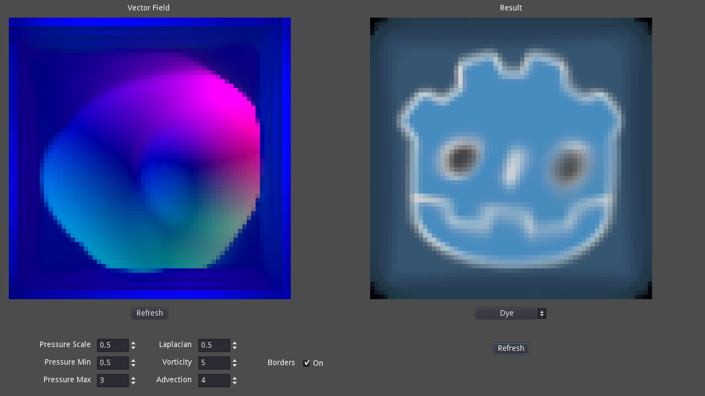
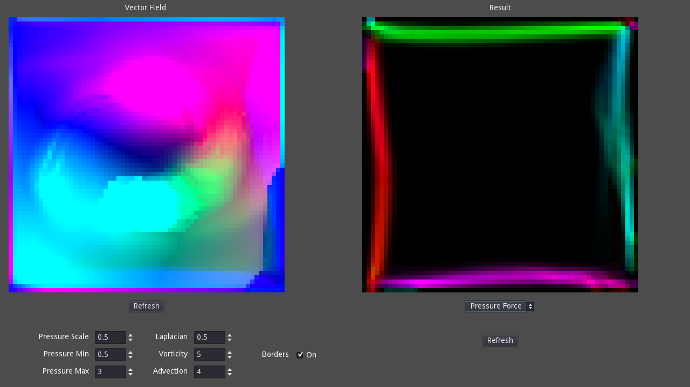
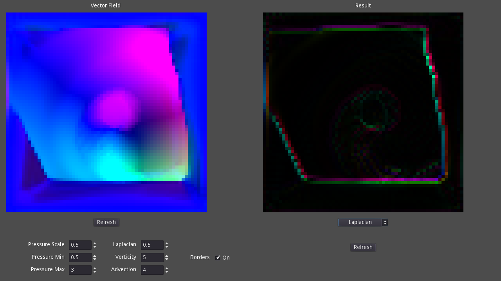
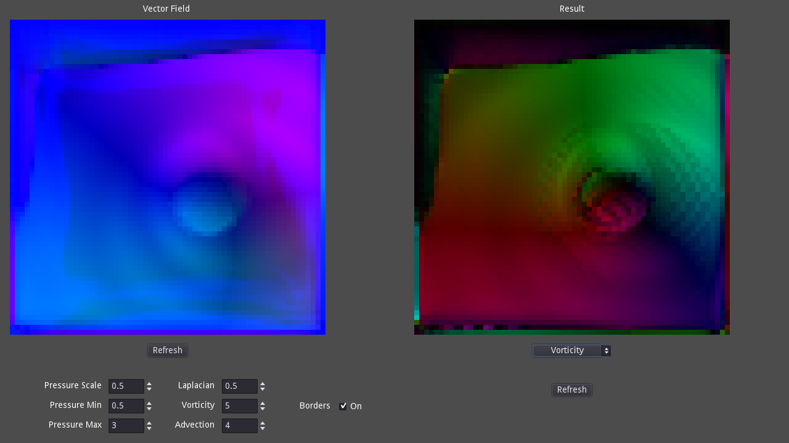

# 2D Fluid Simulator
### In progress  
Made in Godot 3.4.2

## Description

A 2D fluid simulation implemented using Godot's shader language and the Navier-Stokes equation.

## Issues

A major hurdle to implementing even this much was the lack of multi-pass support. I used Godot's suggested means of simulating multi-pass post-processing from their documentation. However, every viewport in a scene adds a delay to the final output image. This problem becomes more pronounced as the number of levels to the iterative pressure gradient increases. Tutorials suggest setting it 50-100.

I implemented both a single-pass and multi-pass approach. Single-pass uses Semi-Lagrangian scheme, while multi-pass uses the more commonly recommended Jacobi iterative method for calculating both pressure and viscosity. After some tuning, I found that the multi-pass approach looked the best. Instability could be avoided at the expense of accuracy by lowering the number of iterations and total viewports in the scene.
## Reference Material
* https://developer.download.nvidia.com/books/HTML/gpugems/gpugems_ch38.html
* https://hal.inria.fr/inria-00596050/document
* https://softologyblog.wordpress.com/2019/03/13/vorticity-confinement-for-eulerian-fluid-simulations/
* https://www.ixm-ibrahim.com/explanations/2d-fluid-simulation
* https://github.com/PavelDoGreat/WebGL-Fluid-Simulation
* https://github.com/haxiomic/GPU-Fluid-Experiments
* https://github.com/mharrys/fluids-2d