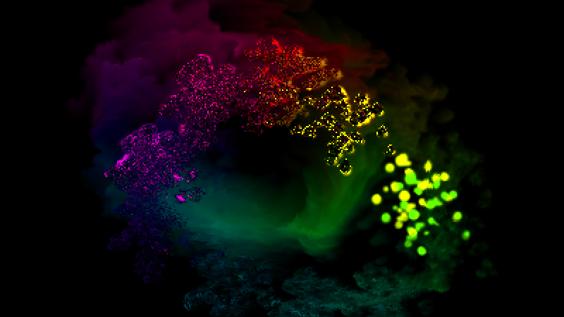
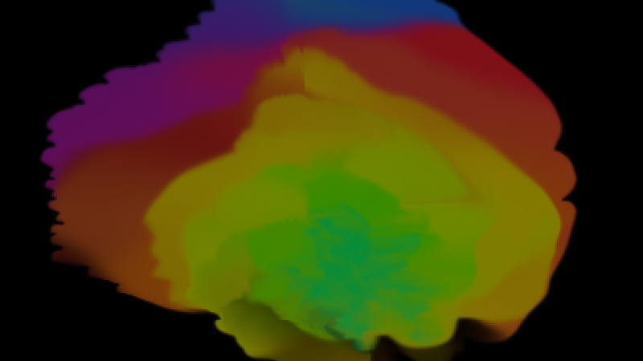

# 2D Fluid Simulator

[Try the Sim](https://maaack.itch.io/2d-fluid-simulator-in-godot)  
Made in Godot 3.4.3

## Description

A 2D Fluid Simulator made in Godot 3.4.3, running on the GPU through Godot’s shader language. It attempts to solve the Navier-Stokes equation in real time by taking advantage of the parallelism of GPU’s.

## Issues

The main demonstration uses layered viewports to simulate multi-passes that converge on solutions for the viscosity as well as the pressure gradient of every pixel. However, every viewport in a scene adds a delay to the final output image. This problem becomes more pronounced as the number of Jacobi iterations for solving the pressure gradient increases. Tutorials suggest setting it 50-100. I have it at 16.

Since the solution to the pressure gradient is perpetually lagging behind the rest of the math (and insufficient anyway), I also don’t use the final vector field as the next frame’s initial vector field. Doing so rapidly caused massive disturbances to the vector field and flashing lights (warning)! I opted instead for using the vector field after viscosity had been added (and before the pressure gradient was subtracted) as the next frame’s initial vector field.

I eventually implemented a single-pass solution after facing challenges to the multi-pass solution. It uses a semi-lagrangian scheme to solve for pressure, and saves the result in the vector fields z-component. Ultimately, I found the multi-pass solution still looked the best. Both demo scenes are included for your own experimentation.

Please share your feedback and suggestions. I’m especially hopeful there are still improvements to be made to the technical side of the simulation.

## Reference Material
* https://developer.download.nvidia.com/books/HTML/gpugems/gpugems_ch38.html
* https://hal.inria.fr/inria-00596050/document
* https://softologyblog.wordpress.com/2019/03/13/vorticity-confinement-for-eulerian-fluid-simulations/
* https://www.ixm-ibrahim.com/explanations/2d-fluid-simulation
* https://github.com/PavelDoGreat/WebGL-Fluid-Simulation
* https://github.com/haxiomic/GPU-Fluid-Experiments
* https://github.com/mharrys/fluids-2d